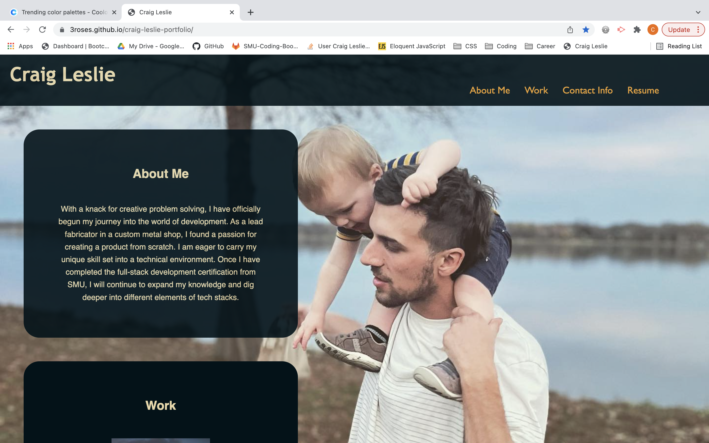

# Craig Leslie's Portfolio

## Objective

The objective of this assignment was to create a portfolio from scratch that showcases my work to potential employers and anyone else who may be interested.
With the skills I have learned in class combined with some further research, I was able to create a responsive webpage portfolio.
As you will see, the work listed is not my own. Since I have just begun my journey into web development, I do not have personal projects to showcase.
This portfolio is arguably my first. The navigation bar at the top will take you through the webpage, and the links to my contact information are active.
Whether you are viewing on a desktop or a mobile device, it should be a smooth and aesthetic user experience.

## Screenshot of webpage

## Link to final page

[Here is a link to my final page](https://3roses.github.io/craig-leslie-portfolio/)

